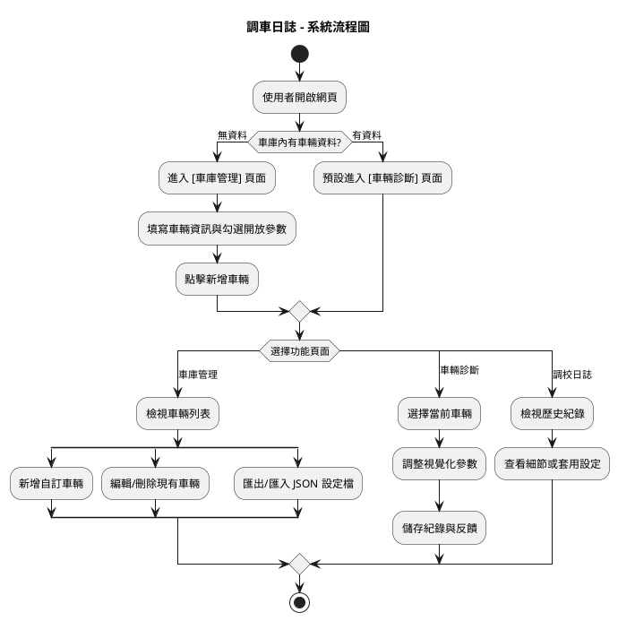

# 調車日誌系統 (Tuning Log)

「調車日誌」是一款專為賽車愛好者、模擬賽車玩家（Sim Racers）或賽道日玩家設計的輕量化 Web 應用程式。本系統提供直覺的「視覺化車輛底盤」介面，讓使用者能輕鬆紀錄與管理車輛的各項調校參數（如胎壓、防傾桿、空力套件等）。結合單圈成績與試駕反饋的紀錄功能，協助使用者追蹤不同設定下的表現差異，進而找到最佳的車輛調校方案。

## 🌟 核心功能 (Features)

### 1. 車庫管理 (Garage Management)
* **自訂車輛**：可新增車輛，輸入包含車輛名稱、車重 (kg)、馬力 (HP)、扭力 (Nm) 等基本資訊。
* **參數客製化**：可針對每台車輛勾選開放調校的參數（如前後防傾桿、前後翼下壓力、前束角、前傾角等，基礎胎壓為必備項目）。
* **車輛列表**：提供車庫列表，方便檢視、編輯或刪除既有車輛。

### 2. 車輛診斷與調校 (Tuning & Diagnostics)
* **視覺化底盤**：互動式介面，包含駕駛艙、輪胎、空力套件及防傾桿等視覺化零件。
* **動態參數調整**：點擊視覺化零件時，右側動態生成對應的參數滑桿（Range Slider），供使用者微調數值並即時預覽。
* **即時儀表板**：可切換當前欲調校的車輛，並即時更新車重、馬力、扭力等資訊。

### 3. 調校日誌管理 (Log Management)
* **紀錄儲存**：可將當前調校參數儲存為紀錄，並輸入「本圈成績（分:秒.毫秒）」與「試駕反饋（文字筆記）」。
* **歷史追蹤**：依照時間倒序呈現特定車輛的歷史調校紀錄。
* **還原設定**：可展開查看單筆紀錄的詳細調校參數，並提供「套用此設定（還原覆蓋當前設定）」及「刪除」功能。

### 4. 資料備份與還原 (Data Backup & Restore)
* **匯出**：將所有車輛與調校紀錄匯出為 JSON 檔案。
* **匯入**：透過上傳 JSON 檔案來匯入並還原車庫資料。

## 💻 技術架構 (Technology)

* **前端架構**：完全基於 HTML5、CSS 與 JavaScript 打造。
* **UI/UX 設計**：
  * 採用 **深色主題 (Dark Mode)**，確保視覺上符合現代軟體與賽車儀表風格。
  * 結合 **Bootstrap 框架** 與 **RWD (Responsive Web Design)** 技術，確保桌機與行動裝置皆具備流暢體驗。
* **資料儲存**：所有邏輯運算與狀態儲存皆於客戶端瀏覽器 (Client-side) 執行，無須依賴後端伺服器。

## 🗺️ 系統流程 (System Flow)

## 📊 競品優勢 (Competitive Advantage)

| 比較項目 | 調車日誌 (本系統) | 傳統試算表 (Excel) | 專業級遙測軟體 |
| :--- | :--- | :--- | :--- |
| **介面直覺度** | 極高 (視覺化互動) | 低 (純文字表格) | 中低 (複雜圖表) |
| **記錄門檻** | 低 (手動輸入反饋) | 中 (需自行建立邏輯) | 極高 (需解讀Telemetry) |
| **建置成本** | 極低 (Web App) | 低 | 高 (需安裝軟體) |
| **優勢** | 視覺化強、行動端友善 | 彈性大、公式自由 | 精準物理數據 |
