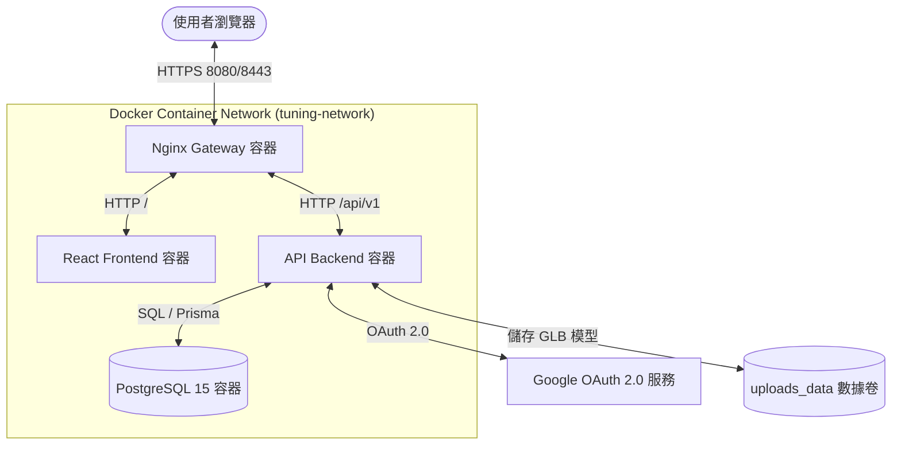

# 調車日誌系統 (Tuning Log) - v3.0

「調車日誌 (Tuning Log)」是一款專為賽車愛好者、模擬賽車（Sim Racing）玩家及賽道日車主設計的**全端容器化 Web 應用程式**。

本系統突破傳統試算表（如 Excel）或複雜遙測軟體（Telemetry）的限制，首創基於 **WebGL (React Three Fiber) 的互動式 3D 車輛底盤** 介面。使用者可直觀地在 3D 模型上點擊零件熱點，彈出半透明的 HUD 懸浮面板進行胎壓、防傾桿、空力下壓力等關鍵參數微調，並結合單圈成績與試駕反饋進行歷史日誌記錄，系統會自動追蹤效能與設定的關聯性，協助您找出最完美的調校設定。

---

## 🌟 核心特色 (Key Features)

### 1. 互動式 3D 底盤調校 (Interactive 3D Tuning)
* **3D WebGL 車輛模型**：前端採用 React Three Fiber (R3F) 渲染高精度 3D 車輛模型，支援滑鼠與觸控的自由旋轉、縮放與平移。
* **動態發光熱點 (Hotspots)**：在輪胎、前後防傾桿、空力尾翼等可調校零件處設有發光熱點，滑鼠懸停時自動放大 1.2 倍，提升視覺回饋。
* **HUD 懸浮調校面板**：點擊熱點即在 3D 空間內彈出半透明的 Glassmorphism（磨砂玻璃）HUD 面板，調整參數滑桿可即時反應在 3D 模型的特定屬性上。

### 2. 雲端車庫與發布管道 (Cloud Garage & Catalog)
* **車庫車輛管理**：使用者可從「公用車輛型錄 (Catalog)」中選取預設的車款，複製到個人專屬車庫。
* **管理員上傳與發布 (Admin Pipeline)**：管理員（Admin）具備專屬面板，可直接上傳全新的 `.glb` 3D 車輛模型檔案、設定該車款**開放調整的參數清單**、以及定義其實體尺寸（長度以公尺為單位），最後將其「發布」至公用型錄供所有用戶克隆。
* **長度驅動自動縮放 (Length-Driven Scale)**：管理員設定車輛實體長度（米）後，3D 引擎會依比例自動縮放模型，確保不同尺寸的車款（如巨大的 GT3 賽車與小巧的卡丁車）在 3D 畫布中呈現正確的比例。

### 3. 調校日誌與歷史追蹤 (Logs & EAV DB Design)
* **單圈成績與備註**：每次調整完設定後，可記錄該次設定的單圈時間（嚴格驗證 `分:秒.毫秒` 格式，如 `01:23.456`）與文字反饋。
* **資料還原 (Rollback)**：日誌列表按時間倒序呈現，使用者可以展開過去的調校紀錄，並點擊「套用此設定」一鍵將目前設定還原成歷史配置。
* **EAV 資料庫設計**：後端採用實體-屬性-值（Entity-Attribute-Value, EAV）架構儲存參數，支持動態參數組合，不會因新增調校項目而需要頻繁修改資料庫 Schema。

### 4. 資安防護與架構隔離 (Security & Isolation)
* **Nginx 邊界網關**：作為系統唯一暴露對外的容器，強制將 HTTP 重導向至 HTTPS（自帶自動生成的自簽 SSL 憑證），並對 API 端點設置速率限制（Auth 端點 15次/分，常規 API 100次/分）。
* **資料庫與 API 隱蔽**：後端 API 容器 (5000 埠) 與 PostgreSQL 容器 (5432 埠) 完全關閉對外映射，只在 Docker 內部虛擬網路 (`tuning-network`) 中互連，免受外網掃描攻擊。
* **安全驗證**：整合 **Google OAuth 2.0** 進行登入驗證，簽發 7 天有效期的 JWT，並以 `HttpOnly`、`Secure` 和 `SameSite=Strict` 的安全 Cookie 保存。
* **防注入與 XSS**：後端使用 Prisma ORM 參數化查詢徹底杜絕 SQL 注入，並對試駕備註輸入內容進行 HTML 實體轉義（Escape），防止 Stored XSS 攻擊。

---

## 🛠️ 技術棧 (Tech Stack)

### 前端 (Frontend)
* **核心框架**：React 18 & Vite
* **3D 引擎**：Three.js & React Three Fiber (R3F) & @react-three/drei
* **樣式設計**：Tailwind CSS (包含 Glassmorphism 磨砂玻璃特效)
* **狀態管理**：Zustand
* **圖標庫**：Lucide React

### 後端 (Backend)
* **伺服器**：Node.js & Express
* **ORM 框架**：Prisma Client (含 DB Push、自動 Migration 與 Seed 腳本)
* **身分驗證**：Google Auth Library & jsonwebtoken
* **檔案處理**：Multer (限制最大 50M 上傳，保留 GLB 檔案於 persistent volume)

### 基礎設施與運維 (Infra)
* **資料庫**：PostgreSQL 15 (Alpine 映像檔)
* **反向代理**：Nginx (包含 SSL 憑證生成與速率限制)
* **容器化**：Docker & Docker Compose (四容器架構：`nginx`、`frontend`、`backend`、`database`)

---

## 🗺️ 系統架構 (System Architecture)

系統採用微網關引導的前後端分離三層式架構，組件運作與網路流向如下：


```mermaid
flowchart TD
    User([使用者瀏覽器]) <-->|HTTPS 8080/8443| Nginx[Nginx Gateway 容器]
    
    subgraph "Docker Container Network (tuning-network)"
        Nginx <-->|HTTP /| Frontend[React Frontend 容器]
        Nginx <-->|HTTP /api/v1| Backend[API Backend 容器]
        Backend <-->|SQL / Prisma| Database[(PostgreSQL 15 容器)]
    end
    
    Backend <-->|OAuth 2.0| GoogleAuth[Google OAuth 2.0 服務]
    Backend <-->|儲存 GLB 模型| UploadsVolume[(uploads_data 數據卷)]
```

---

## 📂 專案結構 (Directory Structure)

```text
├── backend/                  # 後端 API 服務
│   ├── prisma/               # Prisma schema 與 seed 資料庫腳本
│   ├── src/                  # 控制器與核心邏輯
│   ├── Dockerfile            # 後端 Docker 構建檔
│   ├── package.json          # 後端套件依賴說明
│   └── server.js             # 後端啟動入口
├── frontend/                 # 前端 SPA 服務
│   ├── src/                  # 前端 React / R3F 源碼
│   │   ├── components/       # 三維畫布、HUD、車庫與日誌組件
│   │   ├── App.jsx           # 版面佈局核心
│   │   ├── store.js          # 全域狀態 (Zustand)
│   │   └── index.css         # 設計系統樣式記號
│   ├── public/               # 前端靜態資源 (包含預載 3D 模型)
│   ├── Dockerfile            # 前端 Docker 構建檔
│   └── package.json          # 前端套件依賴說明
├── nginx/                    # Nginx 網關代理
│   ├── nginx.conf            # HTTPS 轉發與 rate-limit 設定
│   └── Dockerfile            # SSL 憑證生成與網關構建
├── modle/                    # 本地備用與測試 3D 汽車 GLB 模型庫
├── docker-compose.yml        # 一鍵式多容器部署設定檔
├── .env                      # 系統環境變數設定
└── Tuning-log_SRS.md / SDD   # 專案符合 ISO/IEEE 標準的規格書與設計文件
```

---

## 🚀 快速開始 (Quick Start)

### 1. 準備工作 (Prerequisites)
確保您的主機已安裝以下軟體：
* [Docker Desktop](https://www.docker.com/products/docker-desktop/) (內含 Docker Compose)
* [Git](https://git-scm.com/)

### 2. 環境變數設定 (Environment Variables)
在專案根目錄下，確認或建立 `.env` 檔案，並配置以下參數：

```env
# 資料庫連線帳密 (Docker 內部使用)
DB_USER=postgres
DB_PASSWORD=tuning_pass_8888
DB_NAME=tuning_log

# JWT 加密金鑰 (請隨機替換為長字串)
JWT_SECRET=neondrive-tuning-jwt-key-2026-secret

# Google OAuth 2.0 用戶端識別碼 (若無，將無法使用 Google 登入)
GOOGLE_CLIENT_ID=您的_GOOGLE_CLIENT_ID.apps.googleusercontent.com

# 管理員 Email 清單 (以逗號分隔，登入符合者會自動獲得 admin 權限)
ADMIN_EMAILS=developer@tuninglog.local,您的Google郵箱@gmail.com
```

### 3. 一鍵啟動 (Run App)
在根目錄下打開終端機，執行以下命令：

```bash
docker compose up --build -d
```

此命令將會：
1. **Nginx**：安裝 OpenSSL，自動生成適用於本地 Localhost 測試的自簽憑證，並啟動代理。
2. **Frontend**：自動打包 React 應用程式，並以 Nginx 代理靜態網頁。
3. **Backend**：下載 Node 依賴，等待資料庫健康檢查通過。
4. **Database**：啟動 PostgreSQL。後端連線後會自動執行 `npx prisma db push` 初始化資料表，並執行 `seed.js` 預載管理員與三款預設車輛（Porsche 911 GT3 RS, Formula SAE Racecar, Electric Rental Kart）。

### 4. 訪問應用程式 (Access)
打開瀏覽器，訪問以下網址：
* **HTTPS 訪問 (推薦)**: [https://localhost:8443](https://localhost:8443)
* **HTTP 訪問 (會自動跳轉至 HTTPS)**: [http://localhost:8080](http://localhost:8080)

*注意：因為使用的是本地自簽 SSL 憑證，瀏覽器可能會顯示「您的連線不是安全連線」，請點選「進階」並選擇「繼續前往 localhost（不安全）」即可正常使用。*

---

## 🔑 登入與測試指引 (Login & Testing)

本系統提供兩種登入方式：

1. **管理員測試 Bypass 登入 (推薦本地開發測試使用)**:
   * 點選登入頁面下方的 **「測試環境訪客登入 (Bypass)」**。
   * **獲得 Admin 權限**：將「電子信箱」填入 `developer@tuninglog.local`，駕駛員姓名隨意填寫，點選進入後即可解鎖管理員專屬的 **「雲端管理 (Cloud Admin)」** 面板。
   * **一般用戶測試**：輸入任何其他 Email（如 `driver@tuninglog.local`），即可以一般車主身分體驗車庫克隆、3D 調校與儲存日誌。

2. **Google 帳戶登入**:
   * 當您的 `.env` 中設定了正確的 `GOOGLE_CLIENT_ID`，點擊「使用 Google 帳戶登入」按鈕。
   * 若您的 Google 信箱列於 `ADMIN_EMAILS` 中，登入後即會被賦予 Admin 權限。

---

## 🛠️ 管理員功能展示 (Admin Walkthrough)

當您以管理員身分登入後，頂部導覽列會多出 **「雲端管理 (Cloud Admin)」** 按鈕：
1. **上傳 3D 模型**：可以選擇本地的 `.glb` 模型上傳（在 `modle/` 資料夾下備有數個 GT3、Audi R8 與卡丁車的 GLB 檔案供您測試）。
2. **底盤與參數校準**：
   * 可為模型輸入真實車長（例如 `4.56` 公尺），系統會自動換算比例。
   * **勾選開放參數**：可以針對此車型勾選要開放給玩家調校的參數（如防傾桿、下壓力、胎壓等）。
3. **發布至型錄**：設定完成後，點擊「發布」，該車款就會出現在公用「車輛型錄」中。
4. **克隆使用**：所有普通用戶即可進入「車庫 (Garage)」，點擊「新增車輛」，從該型錄一鍵克隆此車款到自己的車庫中開始調車！
