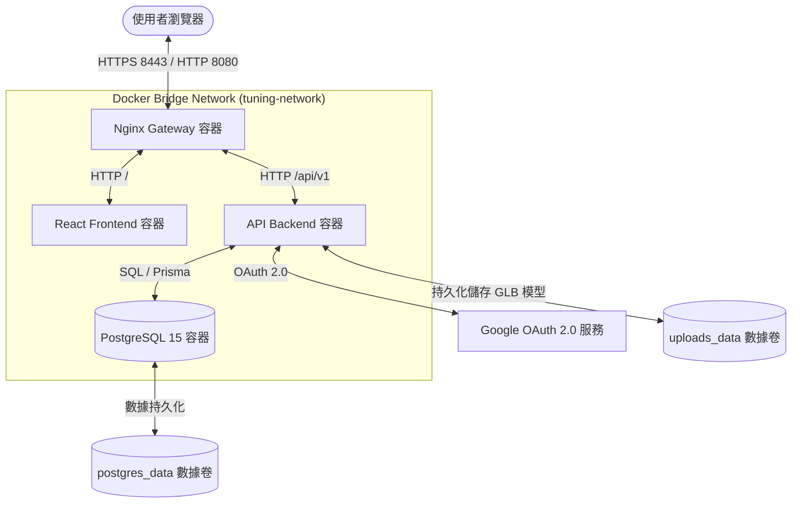

# 調車日誌系統 (Tuning Log) - v3.0

「調車日誌 (Tuning Log)」是一款專為賽車愛好者、模擬賽車（Sim Racing）玩家及賽道日車主設計的**全端容器化 Web 應用程式**。

本系統突破傳統試算表（如 Excel）或複雜遙測軟體（Telemetry）的限制，首創基於 **WebGL (React Three Fiber) 的互動式 3D 車輛底盤** 介面。使用者可直觀地在 3D 模型上點擊零件熱點，彈出半透明的 HUD 懸浮面板進行胎壓、防傾桿、空力下壓力等關鍵參數微調，並結合單圈成績與試駕反饋進行歷史日誌記錄，系統會自動追蹤效能與設定的關聯性，協助您找出最完美的調校設定。

---

## 📋 需求分析 (Requirements Analysis)

本系統的設計與開發嚴格遵循 **[Tuning-log_SRS.md](file:///d:/Code/web/mid/Tuning-log_SRS.md) (符合 ISO/IEC/IEEE 29148:2018 標準)** 的規範，以下為核心功能性與非功能性需求的分析摘要：

### 1. 功能性需求 (Functional Requirements)
* **身分驗證與安全會話 (REQ-SW-001 ~ REQ-SW-004)**：
  * 整合 **Google OAuth 2.0** 第三方驗證登入。
  * 提供開發與展示專用的 **測試環境訪客登入 (Bypass)** 模式，可快速切換 Admin/User 角色。
  * 驗證通過後簽發 **7 天存活期 JWT**，並透過 `HttpOnly`、`Secure` 與 `SameSite=Strict` 安全 Cookie 機制保存於客戶端。
* **雲端車庫與配置管理 (REQ-SW-005 ~ REQ-SW-008)**：
  * 使用者可從「公用車輛型錄」中複製預設車款到個人專屬車庫。
  * 支援車輛基本規格（車重、最大馬力、扭力）與 3D 模型路徑持久化儲存。
  * 提供「開放參數限制清單」（如某車型僅開放調整胎壓與防傾桿，其餘鎖定）。
  * 支援車輛刪除時的資料庫**級聯刪除（ON DELETE CASCADE）**，自動清除其關聯之日誌與參數。
* **3D WebGL 互動式調校 (REQ-SW-009 ~ REQ-SW-015)**：
  * 利用 WebGL 渲染互動式 3D 車體模型，支援旋轉、縮放與平移操控。
  * 於車輛特定可調零件座標點渲染 HTML 發光熱點（Hotspots）按鈕，滑鼠懸停時放大 1.2 倍。
  * 點擊熱點彈出半透明 Glassmorphism HUD 調校面板。
  * 參數滑桿變更時，即時更新 Zustand 狀態機、同步修改 3D 模型零件結構，並支援**對稱零件數值同步**（如左前輪胎壓變更，可選同步至右前輪）。
* **日誌紀錄與設定還原 (REQ-SW-016 ~ REQ-SW-019)**：
  * 單圈時間輸入支援強大的正則表達式校驗：`分:秒.毫秒` 格式（如 `01:23.456`）。
  * 歷次調校日誌按時間降序排列。
  * 支援 **設定還原 (Rollback)**：可點擊歷史紀錄「套用此設定」一鍵將目前配置還原為歷史參數。
* **設定備份與導入 (REQ-SW-020 ~ REQ-SW-021)**：
  * 支援將使用者旗下所有車輛與歷史日誌一鍵匯出為單一 JSON 檔案。
  * 支援上傳備份 JSON 進行雲端資料庫合併。

### 2. 非功能性需求 (Non-Functional Requirements)
* **易用性與響應式排版 (REQ-NFR-001 ~ REQ-NFR-002)**：
  * 透過 CSS 媒體查詢，當螢幕寬度小於 768px（手機板）時，自動將 3D 畫布與面板轉為**上下垂直單欄佈局**。
  * 所有按鈕懸停與參數變更均提供 **200 毫秒平滑過渡動畫**。
* **安全性與邊界隔離 (REQ-NFR-003 ~ REQ-NFR-007)**：
  * **HTTPS 強制跳轉**：Nginx 將所有 HTTP 8080 流量 307 重導向至 HTTPS 8443 加密通道。
  * **速率限制 (Rate Limiting)**：Nginx 對驗證端點限制 15 次/分，常規 API 100 次/分，防止暴力破解與 DDoS。
  * **隱蔽式網路隔離**：後端與資料庫容器不對宿主機映射埠口，完全關閉外網連線，僅在 Docker Bridge 內網互連。
  * **XSS 與 SQL 注入防護**：對試駕反饋輸入內容進行 HTML 實體轉義（Escape）；後端使用 Prisma ORM 參數化查詢徹底防堵 SQL 注入。
* **效能與可用性 (REQ-NFR-008 ~ REQ-NFR-010)**：
  * 3D 場景渲染率穩定保持在 **60 FPS 以上**。
  * 後端 API 處理延遲（不含網路傳輸）小於 **200 毫秒**。
  * 配置 Docker 健康檢查與 `restart: always` 重啟策略，偵測服務斷線後 10 秒內自動重啟。

---

## 📐 系統設計 (System Design)

系統的架構設計與模組拆解完全依據 **[Tuning-log_SDD.md](file:///d:/Code/web/mid/Tuning-log_SDD.md) (符合 IEEE Std 1016-2009 標準)** 實現，核心設計要點如下：

### 1. 三層式容器網關架構
系統採用 **微網關引導的前後端分離三層式架構**。Nginx 作為網關代理，處理 SSL 憑證終止與動態路由分發。前端 React SPA 與後端 Node.js API 及 PostgreSQL 15 資料庫處於隔離網路，保障資料安全。

### 2. 3D WebGL 引擎關鍵邏輯 (ThreeCanvas)
前端核心組件 [ThreeCanvas.jsx](file:///d:/Code/web/mid/frontend/src/components/ThreeCanvas.jsx) 的設計考量了高度的相容性與使用者體驗：
* **長度驅動自動縮放 (Length-Driven Scale)**：
  不同來源的 GLB 模型其 native 單位可能不一致。組件在載入模型時會自動計算其 meshes 圍繞的 **Bounding Box（包圍盒）**，以模型最長水平尺寸作為基準，對照資料庫中該車輛設定的「真實實體長度（米，`lengthM`）」計算出精確的縮放比例（`baseScale`），並將車身中心復位至 Canvas 原點，確保任何車款（如長 4.56 米的 GT3 賽車與 1.8 米的卡丁車）在 3D 畫布中比例均正確。
* **相機聚焦與插值平滑移動 (Camera Controller Lerping)**：
  當使用者點擊某個零件熱點（如左前輪 `pressure_fl`）時，系統會計算該熱點的 3D 坐標以及對應的相機特寫角度。利用 React Three Fiber 的 `useFrame` 鉤子，在每一幀中對相機位置（Position）與 OrbitControls 觀察點（Target）進行 **Lerp（線性插值）** 計算，提供 500ms 的平滑特寫鏡頭移動。**若使用者在此期間手動拖拽/縮放畫布，插值動畫將會立刻被中斷**，避免爭奪相機控制權。
* **底盤透視效果 (Mesh Transparency Shifting)**：
  調校懸吊系統高度與阻尼時，由於避震器常隱藏在車身內部，系統會在選取懸吊相關熱點時，自動遍歷 3D 模型的 Mesh 節點，若節點名稱包含 `body`, `door`, `hood` 等車殼關鍵字，會將該 Mesh 材質透明度設為 `0.15` 並啟用 `transparent = true`，對底盤零件進行半透明透視顯影；關閉懸吊選取時自動復原，提升調校直覺度。

### 3. EAV 動態參數資料庫設計
本專案採用 **實體-屬性-值（Entity-Attribute-Value, EAV）** 模式設計調校數值儲存：
* **設計動機**：不同車型開放調整的參數差異極大（卡丁車無空力套件、方程式賽車有複雜的懸吊阻尼），若採用傳統「寬表寬欄」設計，不僅會產生大量 NULL 欄位，未來一旦新增調校項目（如：剎車平衡 `brake_bias`），就必須變更資料庫 Schema。
* **實作方案**：將調校主表 `TuningLog` 與動態數值副表 `TuningValue` 分離。每次存檔時，主表記錄單圈與備註，副表則儲存多個「參數鍵名-數值」對應列。
* **級聯刪除 (Cascade Delete)**：主副表及車輛表之間在 [schema.prisma](file:///d:/Code/web/mid/backend/prisma/schema.prisma) 中設置了 `onDelete: Cascade` 強大約束，防止資料庫孤立。

---

## 🛠️ 使用技術與開發工具 (Tech Stack & Tools)

本系統使用了現代全端開發中多項主流的技術與工程工具：

### 1. 前端開發技術 (Frontend Stack)
* **React 18 & Vite**：高效的 UI 視圖庫與極速的開發編譯工具。
* **Three.js & React Three Fiber (R3F) & @react-three/drei**：基於 WebGL 的 3D 渲染核心，將命令式的 Three.js 轉譯為聲明式的 React 組件。
* **Zustand**：超輕量且高效的 React 狀態管理庫，負責處理 JWT 令牌、當前選中車型、HUD 零件狀態與即時調校數值。
* **Tailwind CSS**：用於建構 Glassmorphism（磨砂玻璃）HUD 特效與流線型響應式佈局。
* **Lucide React**：精美、簡約的載入與操作 icon 圖標。

### 2. 後端開發技術 (Backend Stack)
* **Node.js & Express**：RESTful API 伺服器，負責業務邏輯處理。
* **Prisma ORM**：現代化關聯型資料庫對照工具，提供高度型別安全的數據存取，支援自動的資料庫遷移與 Seed 腳本。
* **jsonwebtoken & google-auth-library**：JWT 會話管理與 Google OAuth 身份認證校驗。
* **Multer**：後端上傳中介軟體，限制 3D 模型 GLB 檔案上傳上限為 50M。

### 3. 基礎設施、維運與開發工具 (Infra & DevOps Tools)
* **PostgreSQL 15 (Alpine)**：關聯式資料庫，儲存使用者、車庫、日誌與 EAV 參數。
* **Nginx (Alpine)**：反向代理與 API 安全網關。
* **OpenSSL**：用於在 Nginx 容器建置時自動產生本地測試自簽 SSL 憑證。
* **Docker & Docker Compose**：進行多容器（四容器）微服務架構的隔離與一鍵打包部署。
* **PowerShell 7**：用於開發環境的自動化打包（[package.ps1](file:///d:/Code/web/mid/package.ps1)）與離線 Docker 映像檔匯出（[build-offline-images.ps1](file:///d:/Code/web/mid/build-offline-images.ps1)）腳本。
* **GitHub Actions**：用於代碼品質 Linting 檢查與 Docker Build 驗證的 CI/CD 自動化管道。

---

## 🗺️ 系統架構 (System Architecture)


```mermaid
flowchart TD
    User([使用者瀏覽器]) <-->|HTTPS 8443 / HTTP 8080| Nginx[Nginx Gateway 容器]
    
    subgraph "Docker Bridge Network (tuning-network)"
        Nginx <-->|HTTP /| Frontend[React Frontend 容器]
        Nginx <-->|HTTP /api/v1| Backend[API Backend 容器]
        Backend <-->|SQL / Prisma| Database[(PostgreSQL 15 容器)]
    end
    
    Backend <-->|OAuth 2.0| GoogleAuth[Google OAuth 2.0 服務]
    Backend <-->|持久化儲存 GLB 模型| UploadsVolume[(uploads_data 數據卷)]
    Database <-->|數據持久化| PostgresVolume[(postgres_data 數據卷)]
```

---

## 🗄️ EAV 資料庫 Schema 詳細規格

本系統使用 [Prisma Schema](file:///d:/Code/web/mid/backend/prisma/schema.prisma) 進行定義，在 PostgreSQL 中的對應結構如下：

### 1. `User` 表 (使用者資料)
* 儲存使用者的身份驗證資訊與角色權限。

| 欄位名稱 (Attribute) | 資料型態 (Type) | 限制 (Constraints) | 說明 (Description) |
| :--- | :--- | :--- | :--- |
| `id` | UUID | PK, Default: UUID() | 使用者唯一識別碼 |
| `googleId` | VARCHAR(255) | UNIQUE, NOT NULL | Google 帳戶的唯一子識別碼 (sub) |
| `email` | VARCHAR(255) | UNIQUE, NOT NULL | 使用者電子信箱 |
| `name` | VARCHAR(100) | NOT NULL | 使用者顯示名稱 / 駕駛員姓名 |
| `role` | VARCHAR(20) | DEFAULT "user" | 權限角色 (`user` 或 `admin`) |
| `createdAt` | TIMESTAMP | DEFAULT NOW() | 帳戶建立時間 |
| `updatedAt` | TIMESTAMP | ON UPDATE NOW() | 帳戶最後更新時間 |

### 2. `Vehicle` 表 (車庫車輛配置)
* 記錄使用者車庫內的車輛。若 `isPublished = true`，則代表該車輛為「公用車輛型錄」中的範本。

| 欄位名稱 (Attribute) | 資料型態 (Type) | 限制 (Constraints) | 說明 (Description) |
| :--- | :--- | :--- | :--- |
| `id` | UUID | PK, Default: UUID() | 車輛唯一識別碼 |
| `userId` | UUID | FK -> `User(id)` (Cascade) | 擁有此車輛的使用者識別碼 |
| `name` | VARCHAR(100) | NOT NULL | 車輛自訂名稱 (如 "911 GT3 RS") |
| `weightKg` | INTEGER | NOT NULL | 車重 (公斤) |
| `horsepowerHp` | INTEGER | NOT NULL | 最大馬力 (匹) |
| `torqueNm` | INTEGER | NOT NULL | 最大扭力 (牛頓米) |
| `modelPath` | VARCHAR(255) | NOT NULL | 3D GLB 模型的靜態讀取路徑 / 上傳路徑 |
| `modelScale` | DOUBLE PRECISION| DEFAULT 1.0 | 模型整體縮放微調比例 |
| `lengthM` | DOUBLE PRECISION| NULL | 車輛實體長度（米，用以長度驅動自動縮放） |
| `allowedParams` | VARCHAR[] | NOT NULL | 開放調校參數代碼陣列（EAV 屬性篩選器） |
| `config` | JSONB | NULL | 存放模型偏移植與 3D 熱點自訂座標偏移配置 |
| `isPublished` | BOOLEAN | DEFAULT false | 是否已發布至公用型錄供其他玩家克隆 |
| `sourceTemplateId`| UUID | NULL | 紀錄此車輛是從哪一個公用 template 克隆而來 |
| `createdAt` | TIMESTAMP | DEFAULT NOW() | 車輛建立時間 |

### 3. `TuningLog` 表 (調校日誌主表)
* 記錄每一次試駕設定對應的賽道成績與文字回饋。

| 欄位名稱 (Attribute) | 資料型態 (Type) | 限制 (Constraints) | 說明 (Description) |
| :--- | :--- | :--- | :--- |
| `id` | UUID | PK, Default: UUID() | 日誌唯一識別碼 |
| `userId` | UUID | FK -> `User(id)` (Cascade) | 記錄擁有者識別碼 |
| `vehicleId` | UUID | FK -> `Vehicle(id)` (Cascade) | 關聯之車輛識別碼 |
| `lapTime` | VARCHAR(12) | NOT NULL | 單圈時間 (正規校驗格式: "MM:SS.SSS") |
| `trackName` | VARCHAR(100) | DEFAULT "未分類" | 測試賽道名稱 |
| `trackLayout` | VARCHAR(100) | NULL | 賽道佈局 (如 "GP Circuit", "Short") |
| `feedbackNotes` | TEXT | NULL | 試駕反饋文字（後端進行 HTML 實體轉義） |
| `createdAt` | TIMESTAMP | DEFAULT NOW() | 日誌建立時間 |

### 4. `TuningValue` 表 (動態參數細項副表 - EAV 核心)
* 採用實體-屬性-值（EAV）架構儲存該次日誌中每個調校滑桿的具體數值。

| 欄位名稱 (Attribute) | 資料型態 (Type) | 限制 (Constraints) | 說明 (Description) |
| :--- | :--- | :--- | :--- |
| `id` | UUID | PK, Default: UUID() | 數值列唯一識別碼 |
| `tuningLogId` | UUID | FK -> `TuningLog(id)` (Cascade) | 隸屬之調校日誌主表識別碼 |
| `paramKey` | VARCHAR(50) | NOT NULL | 參數鍵名代碼 (如 `pressure_fl`, `aero_r`) |
| `paramValue` | DOUBLE PRECISION| NOT NULL | 設定的實體調校數值 (如 `26.4`, `8.5`) |

---

## 🔌 API 端點規格表 (API Specifications)

本系統全部 API 皆使用 JSON 格式進行數據傳輸。除登入端點外，其餘端點皆需在請求標頭帶上 `Authorization: Bearer <JWT>`。

| 模組分類 | 請求方法 | 路由端點 (Route Endpoint) | 權限級別 | 傳入參數說明 | 回傳格式簡述 (200 / 201) |
| :--- | :--- | :--- | :--- | :--- | :--- |
| **Auth** | `POST` | `/api/v1/auth/google` | 公開 | `{ token: "Google ID Token" }` | 簽發 JWT 及 User 資訊物件 |
| **Auth** | `POST` | `/api/v1/auth/guest` | 公開 | `{ name: "訪客名稱" }` | 簽發訪客繞過 JWT 及 User 資訊 |
| **Auth** | `POST` | `/api/v1/auth/guest-cleanup`| 使用者 | 無 | 登出時自動清除訪客產生的臨時數據 |
| **Catalog**| `GET` | `/api/v1/catalog` | 使用者 | 無 | 回傳所有管理員發布的車輛型錄範本 |
| **Catalog**| `POST` | `/api/v1/vehicles/from-catalog/:templateId` | 使用者 | URL 參數: templateId | 複製型錄範本至使用者個人車庫 |
| **Garage** | `GET` | `/api/v1/vehicles` | 使用者 | 無 | 回傳該使用者車庫內的所有車輛列表 |
| **Garage** | `POST` | `/api/v1/vehicles` | 使用者 | `{ name, weightKg, horsepowerHp, torqueNm, modelPath, allowedParams }` | 建立的自訂車輛資料物件 |
| **Garage** | `DELETE`| `/api/v1/vehicles/:id` | 使用者 | URL 參數: 車輛 id | `{ status: "success" }` (級聯刪除日誌) |
| **Logs** | `GET` | `/api/v1/logs/:vehicleId` | 使用者 | URL 參數: vehicleId | 該車輛的歷史調校日誌陣列 (降序) |
| **Logs** | `POST` | `/api/v1/logs` | 使用者 | `{ vehicle_id, lap_time, feedback_notes, track_name, track_layout, params: {...} }` | 建立成功的日誌物件 |
| **Logs** | `DELETE`| `/api/v1/logs/:id` | 使用者 | URL 參數: 日誌 id | `{ status: "success" }` |
| **Admin** | `POST` | `/api/v1/admin/models` | 管理員 | Form-Data: `model` (GLB 檔案，最大 50MB) | `{ data: { model_path: "/api/v1/models/filename.glb" } }` |
| **Admin** | `GET` | `/api/v1/admin/vehicles` | 管理員 | 無 | 回傳系統內所有車輛範本（含克隆次數） |
| **Admin** | `DELETE`| `/api/v1/admin/vehicles/:id` | 管理員 | URL 參數: 範本 id | 從雲端資料庫徹底清除該車輛範本 |
| **Admin** | `PUT` | `/api/v1/vehicles/:id/scale` | 管理員 | `{ model_scale: Float, length_m: Float/Null }` | 重新校正後的車輛資料物件 |
| **Admin** | `PUT` | `/api/v1/vehicles/:id/config`| 管理員 | `{ config: { modelOffset: [], hotspots: {} } }` | 重新校準熱點位置後的車輛資料物件 |
| **Admin** | `PUT` | `/api/v1/vehicles/:id/publish`| 管理員 | `{ is_published: Boolean }` | 變更發布狀態後的車輛資料物件 |
| **Backup** | `GET` | `/api/v1/backup/export` | 使用者 | 無 | 一鍵打包下載的車庫與日誌備份 JSON |
| **Backup** | `POST` | `/api/v1/backup/import` | 使用者 | 備份 JSON 數據載荷 | 數據庫合併成功的狀態資訊 |

---

## 🚀 快速開始 (Quick Start)

### 1. 準備工作 (Prerequisites)
確保主機已安裝以下軟體：
* [Docker Desktop](https://www.docker.com/products/docker-desktop/) (內含 Docker Compose)
* [Git](https://git-scm.com/)

### 2. 環境變數設定 (Environment Variables)
在專案根目錄下，確認或建立 `.env` 檔案，並配置以下參數：

```env
# 資料庫連線帳密 (Docker 內部橋接虛擬網路連線)
DB_USER=postgres
DB_PASSWORD=tuning_pass_8888
DB_NAME=tuning_log

# JWT 加密金鑰 (請隨機替換為長字串)
JWT_SECRET=neondrive-tuning-jwt-key-2026-secret

# Google OAuth 2.0 用戶端識別碼 (若無，將無法使用 Google 登入)
GOOGLE_CLIENT_ID=您的_GOOGLE_CLIENT_ID.apps.googleusercontent.com

# 管理員 Email 清單 (以逗號分隔，登入符合者會自動獲得 admin 權限)
ADMIN_EMAILS=developer@tuninglog.local,您的Google郵箱@gmail.com
```

### 3. 一鍵啟動 (Run App)
在根目錄下打開終端機，執行以下命令：

```bash
docker compose up --build -d
```

此命令將會自動執行以下流程：
1. **Nginx**：安裝 OpenSSL，自動生成適用於本地 Localhost 測試的自簽憑證，並啟動代理。
2. **Frontend**：自動打包 React 應用程式，並以 Nginx 代理靜態網頁。
3. **Backend**：下載 Node 依賴，等待資料庫健康檢查通過。
4. **Database**：啟動 PostgreSQL。後端連線後會自動執行 `npx prisma db push` 初始化資料表，並執行 `seed.js` 預載管理員與三款預設車輛（Porsche 911 GT3 RS 等）。

### 4. 訪問應用程式 (Access)
打開瀏覽器，訪問以下網址：
* **HTTPS 訪問 (推薦)**: [https://localhost:8443](https://localhost:8443)
* **HTTP 訪問 (會自動跳轉至 HTTPS)**: [http://localhost:8080](http://localhost:8080)

*注意：因為使用的是本地自簽 SSL 憑證，瀏覽器可能會顯示「您的連線不是安全連線」，請點選「進階」並選擇「繼續前往 localhost（不安全）」即可正常使用。*

---

## 📦 運維與自動化部署工具 (DevOps Scripts)

為了簡化部署與移轉流程，根目錄下備有兩個功能強大的 **PowerShell 7** 自動化維運腳本：

### 1. 專案一鍵打包腳本：[package.ps1](file:///d:/Code/web/mid/package.ps1)
此腳本為開發者或運維人員提供「生產環境轉移打包」功能：
* **資料庫即時導出**：自動向運行中的 PostgreSQL 容器執行 `pg_dump`，並將最新數據儲存為 `postgres-init/init.sql`，確保新部署的電腦能直接載入舊有日誌與車輛。
* **源碼封裝過濾**：自動建立 `tuning-log-deploy` 臨時目錄，複製所有原始碼、設定檔（包括 `.env`）、Nginx 憑證設定等，自動過濾並排除 `.git/`、`node_modules/`、`dist/` 以及大容量壓縮檔。
* **產生啟動包**：自動在打包檔案中寫入適用於 Windows 的 `start.bat` 與 Linux/Mac 的 `start.sh`「一鍵啟動腳本」，並產出 `README_DEPLOY.md` 部署引導。
* **壓縮輸出**：將所有內容封裝為一個隨攜型壓縮包 `tuning-log-deploy.zip`。

### 2. 離線映像檔匯出腳本：[build-offline-images.ps1](file:///d:/Code/web/mid/build-offline-images.ps1)
在許多「無外網連線」的機房或管制區環境，Docker Compose 無法從 Docker Hub 拉取基礎 Image。此腳本能協助您製作「離線部署包」：
* **映像檔封裝**：先執行 `docker compose build`，隨後將 PostgreSQL、前端 Web、後端 API 及 Nginx Gateway 四個 Docker Images 分別執行 `docker save` 導出為 `.tar` 映像存檔。
* **產生載入腳本**：在輸出的 `docker-images/` 目錄中自動產生 `load-images.bat` (Windows) 與 `load-images.sh` (Linux)，使用者攜帶此目錄至離線電腦雙擊即可自動載入所有映像檔，無需連接外網。

---

## 🔑 使用者與管理員操作指引 (Walkthrough)

### 1. 身分登入
* **一般車主測試**：點選登入頁面下方的「測試環境訪客登入 (Bypass)」，輸入您的姓名與電子信箱，點擊即可登入。您可以克隆型錄車輛、點擊 3D 調整參數、儲存單圈日誌與下載 JSON 備份。
* **管理員測試 (Admin 解鎖)**：使用 Bypass 登入時，電子信箱請填寫 **`developer@tuninglog.local`**，即可解鎖頂部導覽列的 **「雲端管理 (Cloud Admin)」** 面板。
* **Google 帳號登入**：若您在 `.env` 設定了 `GOOGLE_CLIENT_ID`，並將您的信箱列入 `ADMIN_EMAILS`，使用 Google 登入後即可直接獲得 Admin 權限。

### 2. 管理員 (Admin) 專屬校準管線 (Cloud Admin Pipeline)
登入 Admin 後，可執行高階 3D 模型校準流程：
1. **上傳 3D 模型**：點選雲端管理，選擇本機的 `.glb` 模型上傳（在 [modle/](file:///d:/Code/web/mid/modle) 資料夾備有數個 GT3、Audi R8 等高精度 GLB 模型供測試）。
2. **長度校準與縮放**：輸入車輛真實實體長度（米），系統將自動縮放 3D 模型。
3. **熱點位置校準**：在 3D 預覽畫面上，可以直接透過滑桿或輸入坐標即時調整 10 個零件熱點的 XYZ 位置。勾選「對稱調整」後，調整左輪熱點，右輪熱點將同步進行 X 軸鏡像位移。
4. **開放參數設定**：勾選該車輛型號要開放供普通用戶調校的參數。
5. **發布**：點擊「發布至型錄」。

### 3. 車手 (User) 常用調校工作流
1. **新增車輛**：進入「車庫 (Garage)」，點擊「新增車輛」，可直接從公用型錄克隆剛才發布的車輛範本到個人車庫。
2. **3D 互動調車**：
   * 在畫布上按住左鍵旋轉車輛，右鍵平移，滾輪縮放。
   * 點選「前翼」或「尾翼」熱點，彈出 HUD 滑桿調整角度。
   * 點選「懸吊」熱點，車身外殼會自動轉為半透明，並露出內部的避震器結構以供調校高度與阻尼。
3. **儲存調校日誌**：調整完後，在右下角選擇測試賽道與佈局，輸入單圈成績（嚴格遵循如 `02:08.520` 格式）與試駕心得，點選儲存。
4. **設定復原**：進入「日誌歷史 (Logs)」，可看見降序排列的歷史紀錄，點選其中一筆「套用此設定」，3D 模型與滑桿數值將一鍵還原至當時狀態。

---

## 👥 版本控制與開發協作規範

本專案之維護與迭代嚴格遵循規範化的 Git 協作與自動化整合流程：

### 1. Git 分支管理策略 (GitHub Flow)
* **`main` 分支**：長期主分支，代表隨時可供生產環境部署的穩定版本。禁止直接推送，必須透過 PR (Pull Request) 合併。
* **`develop` 分支**：長期開發分支，用於整合所有已完成的功能。
* **`feature/*` 分支**：短期特徵分支，命名如 `feature/auth-google`。開發完成後向 `develop` 發起 PR 合併。
* **`hotfix/*` 分支**：緊急修復分支，當 `main` 出現重大 Bug 時切出，修復後須同時合併回 `main` 與 `develop`。

### 2. Git 提交訊息規範 (Commit Message Specification)
團隊成員在進行 `git commit` 時，提交訊息必須嚴格遵循 **Angular Commit Message 規範**：
* 格式：`<type>(<scope>): <subject>`
* 常見類型 (`type`)：
  * `feat`：新增功能（Feature）。
  * `fix`：修復 Bug。
  * `docs`：僅修改文檔（如需求書、README.md）。
  * `style`：不影響代碼邏輯的代碼樣式變更（格式化、缺少分號等）。
  * `refactor`：重構（既非新增功能也非修復 Bug 的代碼變更）。
  * `test`：新增或修改測試案例。
  * `chore`：構建程序、輔助工具或依賴庫（如 Dockerfile）的變更。

### 3. CI/CD 自動化流程 (GitHub Actions)
專案配置了自動化工作流檔案，代碼在 Push 或 Pull Request 時會觸發工作流：
1. **代碼品質校驗 (Code Quality)**：自動執行前端 ESLint 與後端 Linter，並執行全端單元測試。
2. **容器化構建測試 (Docker Build)**：自動在 GitHub 環境中建置 Frontend 與 Backend 的 Docker Image，驗證編譯無誤，防範部署失敗之窘境。
