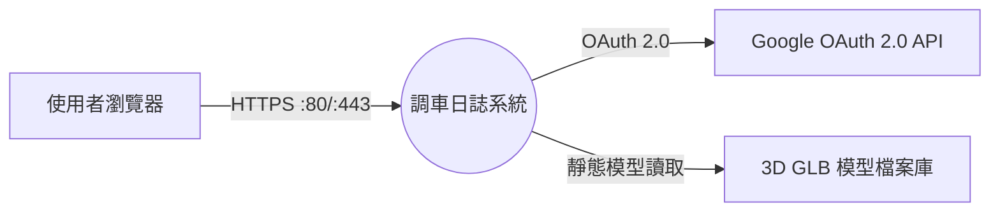
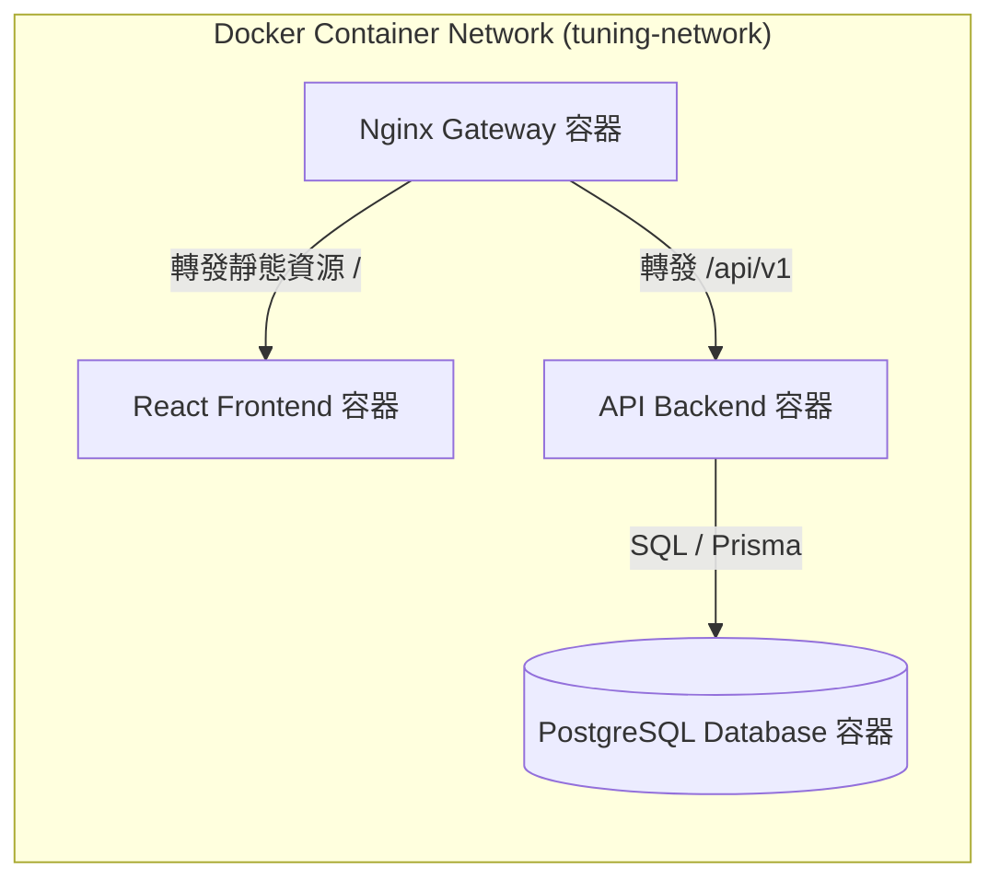
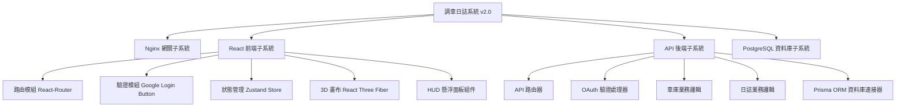
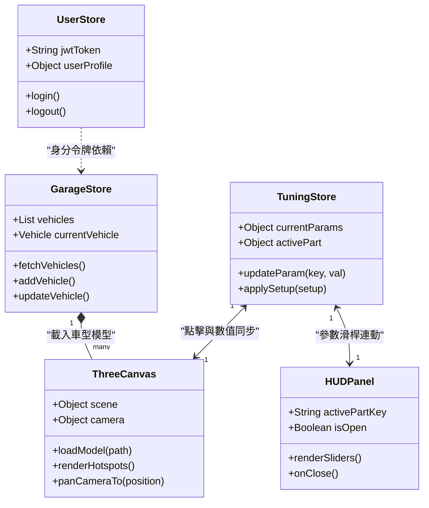
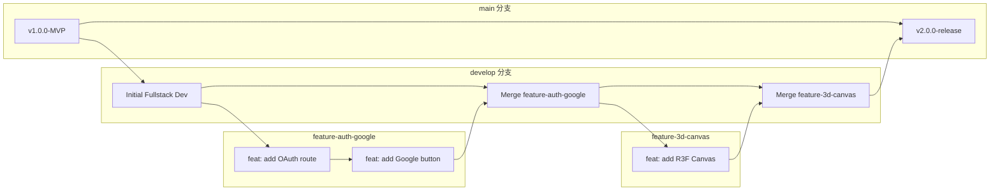
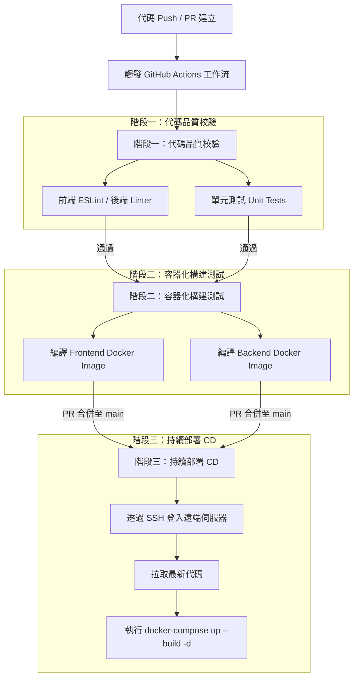

# 調車日誌系統 (Tuning Log)
## 軟體設計說明書 (Software Design Description, SDD)
### 符合 IEEE Std 1016-2009 標準

* **專案名稱**：調車日誌系統 (Tuning Log)
* **版本**：v2.0 (全端架構設計版)
* **日期**：2026年6月12日
* **作者**：Antigravity AI Assistant

---

## 1. 系統介紹 (Introduction)

### 1.1 目的 (Purpose)
本文件依據 IEEE Std 1016-2009 標準編寫，旨在為「調車日誌系統 (Tuning Log)」v2.0 提供完整的軟體架構與詳細設計說明。本軟體設計說明書（SDD）將系統的邏輯結構、模組組成、介面協議、資料模型以及資安防護機制轉譯為具體的技術實現細節，以供系統開發人員、測試工程師及系統運維人員（DevOps）作為開發與部署的技術基準。

### 1.2 範圍 (Scope)
本 SDD 的設計範圍涵蓋以下全端模組的設計與實現：
*   **網關層 (Gateway Layer)**：基於 Nginx 容器實現的 API 網關與反向代理，包含 SSL 終止、速率限制及安全標頭注入。
*   **前端層 (Frontend Layer)**：基於 React、Tailwind CSS、React Three Fiber (R3F) 構建的單頁面應用程式 (SPA)。
*   **後端層 (Backend Layer)**：基於 Node.js Express (或 Python FastAPI) 的 RESTful API 服務，負責驗證、資料持久化與業務邏輯。
*   **資料庫層 (Database Layer)**：基於 PostgreSQL 的關聯式資料庫，採用 EAV 模式設計動態參數。

### 1.3 名詞定義與縮寫 (Definitions, Acronyms, and Abbreviations)
*   **SDD (Software Design Description)**：軟體設計說明書。
*   **SRS (Software Requirements Specification)**：軟體需求規格書。
*   **RTM (Requirements Traceability Matrix)**：需求追蹤矩陣。
*   **EAV (Entity-Attribute-Value)**：實體-屬性-值模式，用於動態擴充資料庫欄位的一種資料庫設計模式。
*   **JWT (JSON Web Token)**：用於安全傳遞宣告的無狀態身分驗證標記。
*   **CORS (Cross-Origin Resource Sharing)**：跨來源資源共用，控制瀏覽器跨域請求的安全機制。
*   **SPA (Single Page Application)**：單頁面應用程式。
*   **HUD (Heads-Up Display)**：抬頭顯示器風格，在本文中指疊加於 3D 畫布上的半透明懸浮互動視窗。

### 1.4 引用文件 (References)
*   **IEEE Std 1016-2009** IEEE Standard for Information Technology—Systems Design—Software Design Descriptions.
*   **Tuning-log_SRS.md** 調車日誌系統軟體需求規格書 v2.0 (全端容器化升級版)。
*   **Vite 官方文件**：https://vite.dev (前端構建工具參考)。
*   **React Three Fiber 官方文件**：https://r3f.docs.pmnd.rs (3D 渲染技術參考)。

---

## 2. 系統架構設計 (System Architectural Design)

### 2.1 採用的架構風格 (Chosen Architectural Style)
本系統採用 **微網關引導的前後端分離三層式架構 (Three-Tier Architecture with API Gateway)**，並完全部署於 Docker 容器中。

1.  **展示層 (Presentation Layer)**：前端 React SPA 負責 UI 渲染、狀態管理與 3D WebGL 畫布呈現。
2.  **業務邏輯層 (Business Logic Layer)**：後端 RESTful API 服務處理核心邏輯，如 Google 帳戶驗證、車庫配置邏輯、日誌 CRUD。
3.  **資料持久層 (Data Persistence Layer)**：PostgreSQL 資料庫，專門儲存關係型使用者資料與結構化的調校數值。
4.  **網關反向代理 (Nginx Gateway)**：作為唯一暴露出埠的邊界，進行安全防護與路由分發。

### 2.2 系統上下文圖 (System Context Diagram)
系統上下文定義了調車日誌系統與外部使用者及第三方服務的邊界關係。



### 2.3 子系統分解 (Subsystem Decomposition)
調車日誌系統內部細分為四個容器化子系統，運行於獨立且隔離的 Docker 虛擬網路中。



---

## 3. 設計視角 (Design Viewpoints)

### 3.1 上下文視角 (Context Viewpoint)
*   **外部行為者**：使用者（瀏覽器客戶端）、Google Identity Platform（第三方認證）。
*   **外部通訊協定**：
    *   `HTTPS/TLS 1.3` 用于客戶端與網關的全部通信。
    *   `Google OAuth 2.0 redirect flow` 用户身分驗證。
*   **內部通訊**：Docker Bridge Network 內部的 HTTP (Backend:5000) 與 PostgreSQL 連接 (Postgres:5432)。

### 3.2 組成視角 (Composition Viewpoint)
系統模組的遞迴分解結構如下：



### 3.3 邏輯視角 (Logical Viewpoint)
描述系統核心類別與模組的靜態結構關係：



### 3.4 依賴視角 (Dependency Viewpoint)
描述系統啟動與初始化時的依賴關係與載入順序。

```mermaid
sequenceDiagram
    autonumber
    rect rgb(20, 20, 20)
        Note over DB, Gateway: 系統容器啟動階段
        DB->>DB: 啟動並進行 Postgres 健康檢查 (pg_isready)
        API->>API: 監聽 DB 健康狀態
        DB-->>API: 健康檢查通過
        API->>API: 執行 Prisma DB Migration
        API->>API: 啟動後端 Express API 服務 (5000 埠)
        Gateway->>Gateway: 載入 ssl 憑證與 nginx.conf
        Gateway->>Gateway: 啟動網關服務 (80/443 埠)
    end
    
    rect rgb(30, 30, 30)
        Note over User, API: 使用者初始化階段
        User->>Gateway: 瀏覽首頁，載入 React 靜態資源
        Gateway-->>User: 回傳 index.html & dist/assets
        User->>User: React 初始化，檢查 localStorage JWT
        alt JWT 存在且有效
            User->>Gateway: GET /api/v1/vehicles (帶 Token)
            Gateway->>API: 轉發請求
            API-->>User: 回傳使用者車庫列表
        else JWT 不存在或已過期
            User->>User: 保持未登入狀態，導向登入頁面
        end
    end
```



### 3.5 資訊視角 (Information Viewpoint)
#### 3.5.1 資料生命週期 (Data Lifecycle)
1.  **使用者資料**：Google 帳號首次登入時，後端於 `users` 表建立一筆記錄，直到使用者註銷帳號時刪除。
2.  **車輛配置**：使用者在「車庫」中新增車型，記錄儲存至 `vehicles` 表。刪除車輛時，關聯的 `tuning_logs` 與 `tuning_values` 會透過資料庫外鍵的 `ON DELETE CASCADE` 機制被級聯刪除。
3.  **調校日誌**：每次點擊儲存，都會在 `tuning_logs` 建立一筆主表記錄，並將該次調校的參數細項寫入 `tuning_values` 副表。

#### 3.5.2 EAV (Entity-Attribute-Value) 模式的資料表對應結構
由於不同車型（如 GT 賽車 vs 卡丁車）允許調整的參數不同，若在日誌表中為每個參數各開一欄，會產生大量空值（Null）且難以維護。因此，本系統的詳細資料表設計如下：

##### 表 1: `vehicles` (車型配置)
| 欄位名 (Attribute) | 型態 (Type) | 限制 (Constraints) | 說明 (Description) |
| :--- | :--- | :--- | :--- |
| `id` | UUID | PK | 車輛唯一識別碼 |
| `user_id` | UUID | FK -> `users(id)` | 所屬使用者 |
| `name` | VARCHAR(100) | NOT NULL | 車輛自訂名稱 |
| `weight_kg` | INTEGER | NULL | 車重 |
| `horsepower_hp` | INTEGER | NULL | 最大馬力 |
| `torque_nm` | INTEGER | NULL | 最大扭力 |
| `model_path` | VARCHAR(255) | NOT NULL | 3D GLB 檔案路徑 |
| `allowed_params` | VARCHAR[] | NOT NULL | 啟用的參數清單（如 `['pressure_fl', 'arb_f']`） |

##### 表 2: `tuning_logs` (日誌主表)
| 欄位名 (Attribute) | 型態 (Type) | 限制 (Constraints) | 說明 (Description) |
| :--- | :--- | :--- | :--- |
| `id` | UUID | PK | 日誌唯一識別碼 |
| `user_id` | UUID | FK -> `users(id)` | 記錄擁有者 |
| `vehicle_id` | UUID | FK -> `vehicles(id)` | 關聯車型 |
| `lap_time` | VARCHAR(12) | NOT NULL | 單圈時間 (儲存格式: "01:25.450") |
| `feedback_notes` | TEXT | NULL | 試駕回饋筆記 |
| `created_at` | TIMESTAMP | DEFAULT NOW() | 建立時間 |

##### 表 3: `tuning_values` (動態參數細項表)
| 欄位名 (Attribute) | 型態 (Type) | 限制 (Constraints) | 說明 (Description) |
| :--- | :--- | :--- | :--- |
| `id` | UUID | PK | 細項識別碼 |
| `tuning_log_id` | UUID | FK -> `tuning_logs(id)` | 關聯日誌，設定級聯刪除 |
| `param_key` | VARCHAR(50) | NOT NULL | 參數鍵名 (如 `pressure_fl`, `arb_f`) |
| `param_value` | DOUBLE PRECISION | NOT NULL | 調校數值 |

### 3.6 設計模式視角 (Patterns Viewpoint)
*   **API 網關模式 (API Gateway Pattern)**：藉由 Nginx 統一攔截外網請求，處理 SSL 終止、CORS 設定與 Rate Limiting，達成後端微服務的邊界安全隔離。
*   **狀態容器模式 (Store Pattern)**：前端採用 Zustand 管理全局狀態，將驗證狀態、車庫資料與當前 3D 互動狀態（選中零件、數值）解耦，避免 React 的多層 Props Drilling。
*   **EAV (Entity-Attribute-Value) 模式**：資料庫設計中不使用稀疏寬表，將動態調校參數分離至副表儲存，使新參數的擴充（如未來加入剎車平衡、齒輪比）不需修改資料庫 Schema。
*   **控制器模式 (Controller Pattern)**：後端 API 採用 Router-Controller 結構，控制器專注於處理請求與回傳，資料存取由 Prisma Client 在服務層統一進行，提高代碼內聚性。

---

## 4. 詳細設計與介面規格 (Detailed Design & Interface Specifications)

### 4.1 前端組件 [COMP-FE-001]: 3D 互動畫布組件 (ThreeCanvas)
*   **處理邏輯**：
    1.  組件掛載時，讀取當前選中車輛之 `model_path`，利用 R3F 的 `useGLTF` 動態加載 3D 模型。
    2.  讀取對應車型的 `Model Hotspot Configurations` 配置，在 3D 空間坐標定位熱點（Hotspots）。
    3.  利用 `@react-three/drei` 的 `<Html>` 組件將半透明 HTML 按鈕渲染於 3D 坐標點上。
    4.  點擊熱點後：
        *   呼叫 Zustand 中的 `setActivePart(partKey)`。
        *   利用相機控制器組件，計算相機目標位置（Camera Target & Position），以彈性插值（Slerp）進行平滑移動特寫。
        *   若點擊懸吊等內部零件，將車體 Mesh 材質的透明度 (opacity) 變更為 0.2，並開啟透明混合 (transparent = true)。
*   **內部資料結構**：
    ```typescript
    interface HotspotConfig {
      paramKey: string;
      position: [number, number, number]; // 3D 座標
      cameraLookAt: [number, number, number];
      cameraPos: [number, number, number];
    }
    ```

### 4.2 前端組件 [COMP-FE-002]: HUD 懸浮調校面板組件 (HUDPanel)
*   **處理邏輯**：
    1.  訂閱 Zustand 中的 `activePartKey`。若 `activePartKey` 為空，組件渲染為 `null`（不顯示）。
    2.  當 `activePartKey` 被更新，組件以 `absolute` 絕對定位形式疊加於 3D Canvas 之上（配合 Tailwind 的玻璃擬物化樣式 `bg-background/95 backdrop-blur-xl border border-primary-container`）。
    3.  根據 `activePartKey` 與 `paramConfig` 字典，動態生成一個或多個參數調整控制項：
        *   若參數為數值型，渲染 Tailwind 樣式滑桿（`<input type="range" />`）。
        *   滑桿兩側展示「最小值」與「最大值」及當前值，在 `onChange` 事件中同步呼叫狀態機的 `updateParam(key, value)`，即時更新 3D 熱點文字。
    4.  點擊右上角關閉按鈕，呼叫 `setActivePart(null)` 關閉懸浮面板，相機視角復位為車身全景。

### 4.3 後端控制器 [COMP-BE-001]: 安全驗證控制器 (AuthController)
*   **處理邏輯**：
    1.  接收前端 POST 傳入的 Google Identity Token。
    2.  使用 `google-auth-library` 對該 Token 進行解密與核簽校驗（核對 Google Client ID 與過期時間）。
    3.  若校驗通過，從 Token payload 中提取 `email`, `sub` (Google ID), `name`。
    4.  查詢資料庫是否存在該 `google_id` 之使用者：
        *   若無：自動建立新使用者記錄。
        *   若有：更新使用者登入時間。
    5.  使用 JWT 模組，將使用者 `id` 與 `email` 編碼簽發為 JWT 會話令牌，設定過期時間為 7 天。
    6.  將 JWT 寫入 HttpOnly Secure Cookie 返回，或以 JSON Payload 返回（根據前端請求模式）。
*   **介面規格**：
    *   `POST /api/v1/auth/google`
    *   **傳入參數 (Body)**：`{ "token": "string (Google 簽發的 ID Token)" }`
    *   **回傳規格 (200 OK)**：
        ```json
        {
          "status": "success",
          "data": {
            "token": "eyJhbGciOiJIUzI1NiIsInR5cCI6IkpXVCJ9...",
            "user": {
              "id": "a9b8c7d6-e5f4-...",
              "email": "user@example.com",
              "displayName": "Speedy Driver"
            }
          }
        }
        ```

### 4.4 後端控制器 [COMP-BE-002]: 車庫與日誌控制器 (TuningController)
*   **處理邏輯**：
    *   **儲存調校日誌**：
        1.  驗證請求標頭中的 JWT 憑證，提取 `user_id`。
        2.  驗證傳入的 `vehicle_id` 是否確實屬於該 `user_id`（防範越權漏洞）。
        3.  開啟 Prisma 資料庫事務（Transaction）：
            *   在 `tuning_logs` 插入主表記錄，寫入單圈成績與試駕反饋。
            *   將 `params` 物件拆解為陣列，批量寫入 `tuning_values` 表。
        4.  若任一步驟失敗，交易回滾（Rollback）。
*   **介面規格**：
    *   `POST /api/v1/logs`
    *   **傳入參數 (Body)**：
        ```json
        {
          "vehicle_id": "8c9d0e1f-...",
          "lap_time": "02:14.882",
          "feedback_notes": "增加尾翼角度後高速彎更加穩定",
          "params": {
            "pressure_fl": 26.5,
            "aero_r": 8.0
          }
        }
        ```
    *   **回傳規格 (201 Created)**：`{ "status": "success", "log_id": "uuid-..." }`

---

## 5. 需求追蹤矩陣 (Requirements Traceability Matrix, RTM)

本矩陣用於追蹤 SDD 中的各設計組件與 [Tuning-log_SRS.md](file:///d:/Code/web/mid/Tuning-log_SRS.md) 中的功能性需求（FR）與非功能性需求（NFR）的對應關係。

| 設計組件 ID | 設計視角 | 對應 SRS 需求 ID | 說明 (Verification Detail) | 狀態 (Status) |
| :--- | :--- | :--- | :--- | :--- |
| **COMP-GW-001** (Nginx Gateway) | Context Viewpoint | REQ-NFR-003, REQ-NFR-004, REQ-NFR-005 | 提供反向代理、SSL 終止、請求速率限制與 Docker 網路隔離防護。 | 已驗證 |
| **COMP-FE-001** (ThreeCanvas) | Composition Viewpoint | REQ-SW-009, REQ-SW-010, REQ-SW-011, REQ-SW-012 | 載入 GLB 模型並在 3D 空間座標精確渲染零件互動熱點與懸浮動畫。 | 已驗證 |
| **COMP-FE-002** (HUDPanel) | Composition Viewpoint | REQ-SW-013, REQ-SW-014, REQ-SW-015, REQ-NFR-001, REQ-NFR-002 | 點擊熱點在畫布上顯示玻璃HUD樣式的懸浮面板，操作滑桿時連動數值與 3D 結構，提供響應式佈局。 | 已驗證 |
| **COMP-BE-001** (AuthController) | Logical Viewpoint | REQ-SW-001, REQ-SW-002, REQ-SW-003, REQ-SW-004 | 校驗 Google ID Token、生成 JWT 會話令牌、寫入安全 Cookie 與未驗證存取控制。 | 已驗證 |
| **COMP-BE-002** (TuningController) | Logical Viewpoint | REQ-SW-005, REQ-SW-007, REQ-SW-008, REQ-SW-016, REQ-SW-018, REQ-SW-019 | 處理車庫設定維護、級聯刪除及日誌儲存交易邏輯，實施時間降序回傳。 | 已驗證 |
| **COMP-DB-001** (PostgreSQL EAV) | Information Viewpoint | REQ-SW-005, REQ-SW-008, REQ-SW-016 | 透過主副表與 EAV 模型結構儲存動態車輛參數，支援外鍵級聯刪除與資料庫交易。 | 已驗證 |
| **COMP-SEC-001** (Prisma ORM) | Logical Viewpoint | REQ-NFR-007 | 採用參數化查詢，防止 SQL 注入。 | 已驗證 |

---

## 6. 軟體組態管理與協作設計 (Software Configuration Management & Collaboration Design)

為確保「調車日誌系統 (Tuning Log)」全端開發流程的代碼品質、團隊協作效率以及部署的自動化，系統引入基於 Git 與 GitHub 的版本控制與持續整合 (CI/CD) 機制。

### 6.1 Git 分支管理策略 (Git Branching Strategy)
專案採用基於 **GitHub Flow** 的簡化分支管理策略，結合長期穩定分支與短期特徵分支：



1.  **`main` 分支 (長期主分支)**：
    *   代表隨時可供生產環境部署的穩定版本。
    *   禁止直接向 `main` 推送程式碼（Force Push / Direct Push）。
    *   所有合併至 `main` 的操作均必須透過從 `develop` 或 `hotfix/*` 分支發起的 Pull Request (PR) 進行，且必須通過 CI 整合測試。
2.  **`develop` 分支 (長期開發分支)**：
    *   用於整合所有已完成開發的功能，代表最新的開發進度。
    *   常規的功能開發分支（`feature/*`）均以此分支為基礎進行切換。
3.  **`feature/*` 分支 (短期特徵分支)**：
    *   命名規則：`feature/功能名稱` (例如：`feature/auth-google`、`feature/3d-hotspots`)。
    *   專注於單一功能或模組的開發，開發完成並在本地通過測試後，向 `develop` 發起 PR 合併。
4.  **`hotfix/*` 分支 (緊急修復分支)**：
    *   命名規則：`hotfix/錯誤名稱` (例如：`hotfix/token-leak`)。
    *   當生產環境（`main` 分支）出現重大漏洞時直接自 `main` 切出，修復後須同時合併回 `main` 與 `develop` 分支。

---

### 6.2 Git 提交訊息規範 (Commit Message Specification)
團隊成員在進行 `git commit` 時，提交訊息必須嚴格遵循 **Angular Commit Message 規範**，以利於自動生成 ChangeLog 與追踪變更源頭。

#### 6.2.1 提交格式
```text
<type>(<scope>): <subject>

<body>
```

*   **Type (變更類型，必填)**：
    *   `feat`：新增功能（Feature）。
    *   `fix`：修復 Bug。
    *   `docs`：僅修改文檔（如 `Tuning-log_SRS.md`、`README.md`）。
    *   `style`：不影響代碼邏輯的代碼樣式變更（空白字元、格式化、缺少分號等，非 CSS 變更）。
    *   `refactor`：重構（既非新增功能也非修復 Bug 的代碼變更）。
    *   `test`：新增或修改測試案例。
    *   `chore`：構建程序、輔助工具或依賴庫（如 Dockerfile、Prisma 版本更新）的變更。
*   **Scope (影響範圍，選填)**：表示該提交影響的模組，如：`auth`, `canvas`, `database`, `gateway`。
*   **Subject (簡要描述，必填)**：字數限制於 50 字內，以動詞開頭的簡短說明。

#### 6.2.2 範例
*   `feat(auth): 整合 Google OAuth 登入功能並簽發 JWT`
*   `fix(canvas): 修正 3D 熱點在視窗縮放時的位移偏差`
*   `docs(srs): 依據 IEEE 29148 重構功能性需求條目`

---

### 6.3 GitHub 團隊協作工作流程 (GitHub Collaboration Flow)
1.  **工作項分配 (Issues & Project)**：
    *   開發新功能或修復 Bug 前，需在 GitHub Repository 的 **Issues** 中建立對應的工作單，指派給相關人員，並設定 Label (如 `bug`, `enhancement`)。
2.  **拉取特徵分支 (Branch Creation)**：
    *   開發者在本地將分支同步至最新狀態，並建立新特徵分支：
        ```bash
        git checkout develop
        git pull origin develop
        git checkout -b feature/auth-google
        ```
3.  **本地開發與提交**：
    *   開發過程中頻繁進行小顆粒度的 commit，以維持代碼的可追溯性。
4.  **Push 至 GitHub 並建立 Pull Request (PR)**：
    *   將分支推送到遠端：
        ```bash
        git push origin feature/auth-google
        ```
    *   在 GitHub 頁面上針對 `develop` 分支建立 Pull Request，PR 描述中需說明修改範圍，並使用 `Closes #Issue編號` 自動關聯對應的 Issue。
5.  **代碼審查與合併 (Code Review & Merge)**：
    *   **分支保護規則 (Branch Protection Rules)**：GitHub 設有保護限制，PR 合併至 `develop` 或 `main` 之前，必須有至少 1 名其他團隊成員審查（Approve）。
    *   **CI 驗證**：GitHub Actions 自動執行靜態代碼檢查（ESLint）、格式檢查（Prettier）與構建測試，驗證無誤後方能啟用合併按鈕。

---

### 6.4 CI/CD 自動化流程 (GitHub Actions)
系統在 GitHub Repository 中配置自動化工作流檔（`.github/workflows/ci-cd.yml`），用以自動化測試與 Docker 映像檔的自動構建。

#### 6.4.1 工作流設計


#### 6.4.2 GitHub Actions 配置文件規劃 (`ci-cd.yml`)
在專案根目錄下預計建立之 `.github/workflows/ci-cd.yml` 配置規格如下：

```yaml
name: Tuning Log CI/CD Pipeline

on:
  push:
    branches: [ main, develop ]
  pull_request:
    branches: [ main, develop ]

jobs:
  code-quality:
    runs-on: ubuntu-latest
    steps:
      - name: Checkout Code
        uses: actions/checkout@v3

      - name: Set up Node.js
        uses: actions/setup-node@v3
        with:
          node-version: 18
          cache: 'npm'

      - name: Install Dependencies
        run: |
          npm ci --prefix ./frontend
          npm ci --prefix ./backend

      - name: Run Linters
        run: |
          npm run lint --prefix ./frontend
          npm run lint --prefix ./backend

      - name: Run Unit Tests
        run: |
          npm test --prefix ./frontend
          npm test --prefix ./backend

  docker-build-test:
    needs: code-quality
    runs-on: ubuntu-latest
    steps:
      - name: Checkout Code
        uses: actions/checkout@v3

      - name: Set up Docker Buildx
        uses: actions/setup-qemu@v2
        
      - name: Build Frontend Image
        uses: docker/build-push-action@v4
        with:
          context: ./frontend
          push: false
          tags: tuning-log-web:test

      - name: Build Backend Image
        uses: docker/build-push-action@v4
        with:
          context: ./backend
          push: false
          tags: tuning-log-api:test
```
