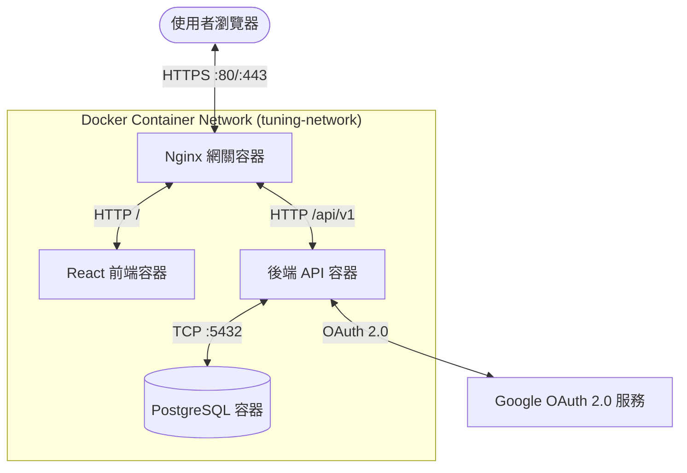

# 需求規格書 (Requirements Specification Document)
## 符合 ISO/IEC/IEEE 29148:2018 標準

* **專案名稱**：調車日誌系統 (Tuning Log)
* **版本**：v3.0 (ISO/IEC/IEEE 29148 規範版)
* **日期**：2026年6月12日
* **作者**：Antigravity AI Assistant

---

## 1. 系統介紹 (Introduction)

### 1.1 目的 (Purpose)
本文件依據 ISO/IEC/IEEE 29148:2018 標準編寫，旨在定義「調車日誌系統 (Tuning Log)」v2.0 全端系統的軟體需求。本文件為開發團隊、測試團隊以及維運團隊提供明確、單一且可驗證的技術需求基準。

### 1.2 系統範圍 (Scope)
本系統提供賽車模擬與賽道日玩家一個用以記錄與管理車輛調校參數的 Web 應用程式。
*   **包含範圍**：使用者註冊驗證（Google OAuth 2.0）、自訂車庫設定、基於 WebGL (React Three Fiber) 的 3D 車型模型互動、HUD 懸浮參數調校、歷史調校日誌管理、JSON 設定檔備份還原，以及基於 Docker Compose 的多容器隔離部署。
*   **不包含範圍**：與特定賽車遊戲的實時遙測數據（Telemetry Data）自動對接（本系統僅提供手動輸入參數與成績的日誌管理功能）。

### 1.3 上下文 (Context)
調車日誌系統作為獨立運行的 Web 服務，透過瀏覽器提供使用者介面，並藉由外部 Google Identity API 進行第三方身分驗證，調校資料統一儲存於獨立的 PostgreSQL 資料庫容器中。

### 1.4 引用文件 (References)
*   **ISO/IEC/IEEE 29148:2018** Systems and software engineering — Life cycle processes — Requirements engineering.
*   **Tuning-log_SDD.md** 調車日誌系統軟體設計說明書 v2.0。
*   **舊版靜態 MVP 展示**：[index.html](file:///d:/Code/web/mid/index.html)。
*   **視覺化網頁原型**：[tuning_log.html](file:///d:/Code/web/mid/tuning_log.html)。

---

## 2. 引用文件與專案概述 (References & Project Overview)

### 2.1 產品定位 (Product Perspective)
系統採用四容器微架構佈署：Nginx 網關容器作為唯一的網路邊界，負責靜態前端代理與後端 API 轉發；React 前端容器、Express API 後端容器與 PostgreSQL 資料庫容器在獨立的 Docker 虛擬網路中互連，確保邊界安全。

### 2.2 系統功能 (System Functions)
*   **身分驗證功能**：整合 Google OAuth 登入並發行安全 JWT 會話記號。
*   **車庫維護功能**：提供內建 3D 模板車型或自訂參數開放清單。
*   **3D 懸浮調校功能**：在 3D 車體模型上點擊熱點以彈出 HUD 風格之懸浮面板進行滑桿微調。
*   **日誌管理功能**：保存參數配置、單圈成績（分:秒.毫秒格式）與試駕筆記，支援還原設定。
*   **檔案備份功能**：車庫與日誌的 JSON 檔案匯出及上傳還原。

### 2.3 使用者特性與關係人描述 (User Characteristics & Stakeholder Profiles)
*   **賽車手 / 模擬賽車玩家**：需要高效率、直覺的 3D UI 來進行調車參數微調，並精準記錄與對比單圈成績。
*   **系統管理員 / DevOps**：要求系統能在一鍵式 Docker 環境中完成部署，並具備自動化的安全防護與健康檢查。

### 2.4 假設、依賴與限制 (Assumptions, Dependencies, and Constraints)
*   **網路依賴**：驗證模組執行時，後端必須能夠向 Google API 伺服器發送 HTTPS 請求以校驗 Token。
*   **客戶端限制**：瀏覽器必須支援 WebGL 2.0 以流暢渲染 3D 畫布。
*   **版本控制與託管依賴**：系統程式碼應託管於 GitHub 平台上，且 CI/CD 自動化建置應依賴 GitHub Actions 工具。

---

## 3. 功能性與非功能性需求 (Functional & Non-Functional Requirements)

### 3.1 功能性需求 (Capabilities / Functional Requirements)

#### 3.1.1 身分驗證與帳戶模組 (Authentication)
*   **REQ-SW-001**：當使用者點擊「使用 Google 帳戶登入」時，前端系統應向 Google OAuth 2.0 API 發起身分驗證請求。
*   **REQ-SW-002**：當 Google 驗證成功後，後端系統應簽發一組存活期限制為 7 天的 JWT 憑證給前端。
*   **REQ-SW-003**：前端系統應將接收到的 JWT 儲存於設定有 `HttpOnly`、`Secure` 與 `SameSite=Strict` 屬性的 Cookie 中。
*   **REQ-SW-004**：當使用者未通過身分驗證時，前端系統應限制使用者存取個人車庫、3D 調校與日誌記錄介面。

#### 3.1.2 車庫與配置模組 (Garage Management)
*   **REQ-SW-005**：當使用者建立自訂車輛時，後端系統應在資料庫 `vehicles` 表中寫入車輛名稱、車重 (kg)、最大馬力 (HP)、最大扭力 (Nm) 及 GLB 模型路徑。
*   **REQ-SW-006**：前端系統應在車庫建立畫面提供 GT 賽車、卡丁車與方程式賽車三種預設 3D 模型選項。
*   **REQ-SW-007**：當使用者設定車輛開放參數時，系統應寫入對應的開放參數代碼數組至資料庫 `allowed_params` 欄位中。
*   **REQ-SW-008**：當使用者刪除特定車輛時，資料庫應自動級聯刪除（ON DELETE CASCADE）該車輛所關聯的所有調校日誌與參數細項。

#### 3.1.3 3D 視覺化與 HUD 懸浮調校模組 (3D Tuning)
*   **REQ-SW-009**：前端系統應在調校介面中央利用 React Three Fiber 渲染互動式 WebGL 3D 畫布。
*   **REQ-SW-010**：前端 3D 畫布應提供滑鼠與觸控之旋轉、縮放與平移控制功能。
*   **REQ-SW-011**：前端系統應在 3D 車型特定零件座標點（包含四輪胎、前後防傾桿、前後翼）渲染 HTML 發光熱點按鈕。
*   **REQ-SW-012**：當滑鼠懸停於熱點時，前端系統應將熱點按鈕放大 1.2 倍並改變其顏色。
*   **REQ-SW-013**：當使用者點擊特定零件熱點時，前端系統應在該熱點旁彈出半透明 HUD 風格的懸浮調校視窗。
*   **REQ-SW-014**：當使用者點擊懸浮調校視窗右上角關閉按鈕或 3D 畫布空白處時，前端系統應關閉該懸浮調校視窗。
*   **REQ-SW-015**：當使用者調整懸浮視窗內的參數滑桿時，前端系統應即時修改 Zustand 狀態，連動更新 3D 熱點文字標籤，並即時變更 3D 模型零件對應的結構屬性。

#### 3.1.4 日誌管理模組 (Tuning Logs)
*   **REQ-SW-016**：當使用者保存調校紀錄時，系統應將當前的所有參數鍵值對寫入 `tuning_values` 表，並將單圈時間與回饋筆記存入 `tuning_logs` 表。
*   **REQ-SW-017**：當使用者輸入單圈時間時，前端系統應驗證輸入值是否符合 `^([0-5][0-9]):([0-5][0-9])\.([0-9]{3})$`（分:秒.毫秒）的正則表達式格式。
*   **REQ-SW-018**：當讀取特定車輛的調校日誌時，後端系統應以 `created_at` 時間降序回傳日誌列表。
*   **REQ-SW-019**：當使用者點擊歷史日誌紀錄的「套用此設定」時，前端系統應將當前調校狀態覆蓋並還原為該筆日誌中的各項參數值。

#### 3.1.5 設定備份與還原模組 (Backup & Restore)
*   **REQ-SW-020**：當使用者點擊「匯出設定」時，前端系統應將該帳戶下所有車輛與歷史調校資料編碼為單一 JSON 檔案並下載至本機。
*   **REQ-SW-021**：當使用者上傳 JSON 設定檔時，後端系統應解析內容並與該帳戶之雲端資料庫資料進行合併。

### 3.2 非功能性需求 (Non-Functional Requirements)

#### 3.2.1 易用性與人因需求 (Usability)
*   **REQ-NFR-001**：前端系統應以 CSS Media Queries 偵測視窗寬度，當寬度小於 768 像素時，將 3D 畫布與調校面板自動轉換為上下垂直單欄排版。
*   **REQ-NFR-002**：所有按鈕的懸停狀態與滑桿變更，應包含時間長度為 200 毫秒的平滑過渡（Transition）動畫。

#### 3.2.2 安全性與資料完整性 (Security)
*   **REQ-NFR-003**：Nginx 網關應將所有埠號 80 的 HTTP 請求，強制執行 301 重導向至埠號 443 的 HTTPS 加密連線。
*   **REQ-NFR-004**：Nginx 網關應對 API 端點設定速率限制，限制 `/api/v1/auth/*` 每單一 IP 每分鐘最多 15 次請求，常規 API 每單一 IP 每分鐘最多 100 次請求。
*   **REQ-NFR-005**：系統部署時，後端 API 與 PostgreSQL 服務容器應拒絕對外網公開埠號（不映射 5000 與 5432 埠至宿主機），僅接受 Docker 虛擬網路內部的內部請求。
*   **REQ-NFR-006**：後端系統在寫入 `feedback_notes` 欄位前，應將字元 `<`、`>`、`&`、`"`、`'` 轉義為對應之 HTML 實體編碼。
*   **REQ-NFR-007**：後端系統必須使用 Prisma 參數化查詢執行所有資料庫查詢，杜絕 SQL 注入風險。

#### 3.2.3 效能與資源分配 (Performance)
*   **REQ-NFR-008**：在符合 WebGL 2.0 規範的硬體裝置上運行 3D 畫布時，場景渲染率應穩定保持在 60 FPS 以上。
*   **REQ-NFR-009**：後端系統處理單次日誌儲存或讀取請求時，平均 API 延遲應小於 200 毫秒（排除外部網路傳輸時間）。

#### 3.2.4 可靠性與可用性 (RAM)
*   **REQ-NFR-010**：PostgreSQL 資料庫與後端 API 容器應配置 Docker 健康檢查，當偵測到服務無法回應時，應在 10 秒內自動執行容器重啟。

---

## 4. 外部介面需求 (External Interfaces)

### 4.1 使用者介面 (User Interfaces)
*   **HUD 懸浮調校視窗介面**：使用者點擊 3D 模型零件後，前端應在 3D 畫布上疊加半透明 HUD 面板（寬度限制為 320 像素），面板外側需配備 `backdrop-blur-xl` 模糊濾鏡特效。

### 4.2 硬體介面 (Hardware Interfaces)
*   **顯示卡支援**：系統需直接與客戶端作業系統之 WebGL 2.0 驅動程式介面連線，以驅動 GPU 渲染車輛模型。

### 4.3 軟體與 API 介面 (Software & API Interfaces)
*   **Google Auth 介面**：後端系統應透過 HTTPS 與 Google Token Verification Endpoint (`https://oauth2.googleapis.com/tokeninfo`) 對接以驗證 Google ID Token。

### 4.4 通訊介面 (Communications Interfaces)
*   **RESTful 傳輸**：前端與後端 API 的所有通訊，應使用基於 TCP/IP 的 HTTP/2 TLS 加密協定，並以 JSON 格式作為資料載荷傳輸介質。

---

## 5. 驗證矩陣 (Verification Matrix)

驗證方法定義：
*   **測試 (Test)**：執行軟體並對結果數值進行程序化判定（例如單圈格式校驗測試）。
*   **分析 (Analysis)**：藉由邏輯推導、代碼審查或數值估算來證實（例如 ORM 參數化防注入分析）。
*   **檢查 (Inspection)**：對程式碼、配置文件或文檔進行靜態檢查（例如確認 Docker 埠號配置）。
*   **演示 (Demonstration)**：操作系統功能以直觀展示其符合性（例如點擊熱點彈出懸浮視窗的動態展示）。

| 需求識別碼 (ID) | 需求簡述 | 驗證方法 | 驗證階段 |
| :--- | :--- | :--- | :--- |
| **REQ-SW-001** | Google OAuth 帳戶驗證 | 演示 (Demonstration) | 系統整合測試 |
| **REQ-SW-002** | 簽發 7 天 JWT 憑證 | 測試 (Test) | 單元與整合測試 |
| **REQ-SW-003** | JWT 寫入 Secure HttpOnly Cookie | 檢查 (Inspection) | 安全審查測試 |
| **REQ-SW-004** | 未驗證使用者存取限制 | 測試 (Test) | 整合與系統測試 |
| **REQ-SW-005** | 自訂車輛寫入資料庫 | 測試 (Test) | 單元與整合測試 |
| **REQ-SW-006** | 預設三種 3D 模型選項 | 演示 (Demonstration) | 功能驗證測試 |
| **REQ-SW-007** | 車輛開放參數寫入 | 測試 (Test) | 單元與整合測試 |
| **REQ-SW-008** | 車輛刪除級聯刪除日誌 | 測試 (Test) | 資料庫整合測試 |
| **REQ-SW-009** | React Three Fiber 3D 渲染 | 演示 (Demonstration) | 使用者介面測試 |
| **REQ-SW-010** | 3D 畫布旋轉、縮放與平移 | 演示 (Demonstration) | 易用性與功能測試 |
| **REQ-SW-011** | 模型熱點發光按鈕定位 | 演示 (Demonstration) | 功能驗證測試 |
| **REQ-SW-012** | 熱點懸浮放大 1.2 倍動畫 | 演示 (Demonstration) | 介面細節測試 |
| **REQ-SW-013** | 點擊熱點彈出懸浮 HUD 面板 | 演示 (Demonstration) | 功能驗證測試 |
| **REQ-SW-014** | 點擊空白處關閉懸浮面板 | 演示 (Demonstration) | 使用者操作測試 |
| **REQ-SW-015** | 滑桿調整動態修改 3D 結構 | 演示 (Demonstration) | 系統集成展示 |
| **REQ-SW-016** | 保存參數、單圈與筆記至日誌 | 測試 (Test) | 單元與整合測試 |
| **REQ-SW-017** | 單圈時間 MM:SS.SSS 格式校驗 | 測試 (Test) | 欄位驗證測試 |
| **REQ-SW-018** | 歷次調校日誌時間降序排列 | 測試 (Test) | API 整合測試 |
| **REQ-SW-019** | 套用此設定還原參數值 | 演示 (Demonstration) | 功能驗證測試 |
| **REQ-SW-020** | 匯出車庫與日誌 JSON 檔 | 測試 (Test) | 單元測試 |
| **REQ-SW-021** | 匯入並合併 JSON 設定檔 | 測試 (Test) | 整合與功能測試 |
| **REQ-NFR-001** | 手機 RWD 單欄排版佈局 | 演示 (Demonstration) | 響應式佈局測試 |
| **REQ-NFR-002** | 200 毫秒平滑過渡動畫 | 分析 (Analysis) | 效能與介面審查 |
| **REQ-NFR-003** | HTTP 強制導向 HTTPS | 測試 (Test) | 安全整合測試 |
| **REQ-NFR-004** | API 速率限制防護 | 測試 (Test) | 壓力與安全測試 |
| **REQ-NFR-005** | API 與 DB 埠隱藏隔離 | 檢查 (Inspection) | 佈署架構審查 |
| **REQ-NFR-006** | 試駕反饋 Stored XSS 轉義 | 測試 (Test) | 安全與漏洞測試 |
| **REQ-NFR-007** | ORM 參數化防注入 | 分析 (Analysis) | 代碼靜態分析 |
| **REQ-NFR-008** | 3D 渲染率 60 FPS 以上 | 測試 (Test) | 效能測試 |
| **REQ-NFR-009** | API 處理延遲小於 200ms | 測試 (Test) | 效能與負載測試 |
| **REQ-NFR-010** | 容器 10 秒自動健康檢查重啟 | 測試 (Test) | 可靠性與容錯測試 |
